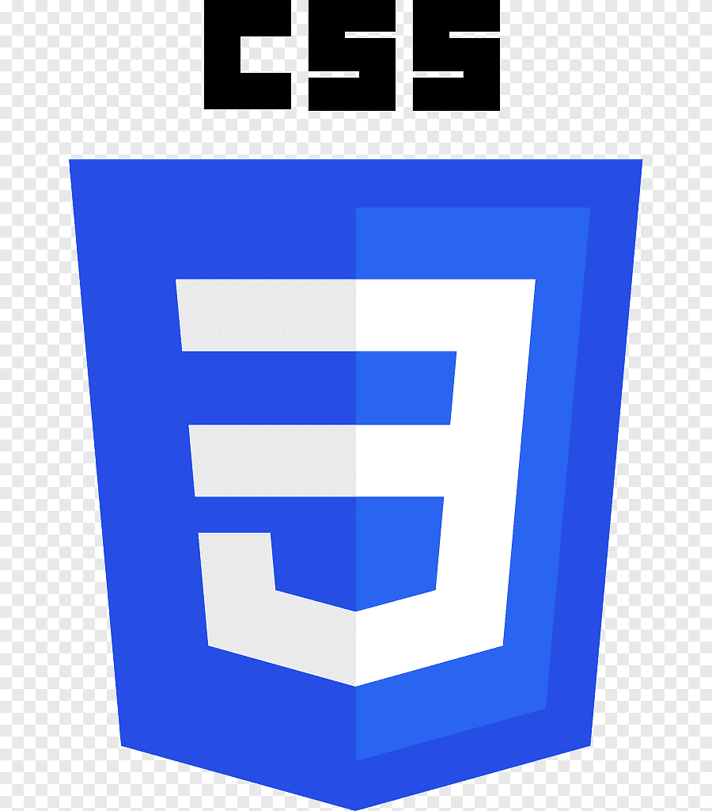
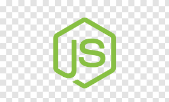

## 💻 Skills

  <h2> General info:</h2>

  - Age: 22 years old
  - College course: Analysis and Systems Development
  - E-mail: leofellipesouza@gmail.com

## 💬 Languages

  
  
  
  
  

## 🚀 Frameworks

  
  

## ♨ Databases

  
  
  

## 🛠 Dev Tools

    
    
  
  
  
  
  

